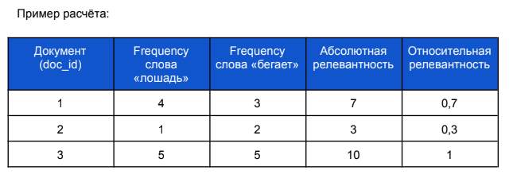

# LeoT is a final project for a C++ developer beginner course.

[Objective](#objective)

[General overview](#general-overview)

[Features](#features)

[Installation](#installation)

[Startup](#startup)

[Testing](#testing)

## Objective

Create a CLI search server with following capabilities

<ul>
  <li>search performed over text documents in the same location as executable file</li>
  <li>  Using JSON interface (<a href="https://github.com/nlohmann/json">nlohmann_json library</a>) for:</li>
  <ul>
    <li>  <b>program configuration</b> is stored in a local config.json formatted cofig file</li>
    <li>  <b> search requests</b> taken from another requests.json file </li>
    <li>  <b>search results</b> are placed answers.json file</li>
  </ul>
  <li>Separate class for <b>periodic indexing</b> of a database is performed based on configuration settings</li>
  <li><b>Unit testing</b> performed using Google tests module</li>
</ul>

## General overview

Upon startup InvertedIndex class instance starts looking for a 'database' directory and searches all .txt files in it. Creates a list of files, reads them in and performs indexing.

After that JSON module initializes and attempts to open up config file and reads configuration settings as well as updates list of files for the database. Search requests are read from a requests.json file 

Then Search Server is started and performs search over the index, handing over results to JSON module and recorded to answers.json file. Additionally, results are displayed in the terminal

Search index contains information about how many times does each word occur in each document.

Search result will calculate relative relevance by calculating absolute relevance first (sum of occurrences of each word in the files. Then relative relevance is calculated by dividing absolute relevance by maximum abs relevance. 

  After this initial search start background check of file database to be indexed in three detached threads
  <ul>
    <li><b>monitor</b> thread of a JSON module that checks if time since last indexing doesn't exceed a setting in the config file. Sets a bool flag when this time exceeds the setting and signals other modules that re-indexing is required</li>
    <li><b>updateIndex</b> thread of InvertedIndex class receives the bool flag and performs reindexing when the flag is set. It performs indexing and sets another bool flag to signal JSON module that indexing was complete</li>
    <li><b>updateJSON</b> thread of a JSON module receives the flag from InvertedIndex class and updates file list in the config.json file. It also updates timestamp of when indexing was performed</li>
  </ul> 
  

  
A command line interface also runs in the background ready for user commands. User has a choice of commands:
      <ul>
          <li>index. manually command the program to re-index database</li>
          <li>search. manually command the program to perform search. At this command the program will read requests from requests.json file and display results in the terminal only</li>
          <li>exit. stop executing the program</li>
      </ul> 
  

## Features

Nlohmann library used to conveniently handle JSON format.

File list is stored in a map for quick access by path. This however leads to doc_id not corresponding directly to file names. It is easy to find which file corresponds to doc_id (and it is implemented when displaying search results in the terminal. 

Indexing of database is performed in multiple threads. Number of threads is determined dynamically during runtime by hardware concurrency.

Monitoring and automatic database indexing is performed in the background using threads (detached). Time between indexing is defined in config.json in minutes. Initially, all re-indexing is performed over all files. However, in future can implement re-indexing of only new/modified files which should considerably reduce time for indexing. Initially, a database of about 1100 files of less than 1000 words each was used and indexing in maximum 4 threads takes about 95 seconds.

Number of search results to be written to answers.json is defined by config.json setting.

## Installation

Compile the program in Debug or Release modes. CMake is configured to copy files: config.json, requests.json, libstdc++-6.dll and 'database' folder to the build directory to allow program operation 'out of the box'. 'database' folder contains several text files for testing purposes.

## Startup

As the program starts it will recursively search ./database folder for text files and create index. It will output status in the command line:

    
    Program LeoT  started..
    creating index... please wait...

When indexing is completed, information about number of unique words and time to create index will be displayed: 

    
    indexing duration: 0.255294 seconds
    Total: 719 unique words indexed
    

Search server initializez and information is displayed in the terminal:

    search sever initialized!
    index created.

JSON module intializes. It will check config.json file and load search requests from requests.json. Information is displayed if JSON has started successfully:

    JSON module initialized

When all module have started up successfully a search is initiated using search strings from requests.json file. Results are displayed in the terminal and also written to answers.json. Results formats in terminal and answers.json file differ. Answers.json will only contain doc_id rank of results while terminal will also contain file name:

Terminal output:

    Request1 results:
    doc: 1, filename: "file002.txt", rank: 1
    doc: 0, filename: "file001.txt", rank: 0.735294
    doc: 3, filename: "file004.txt", rank: 0.529412
    doc: 2, filename: "file003.txt", rank: 0.147059
    Request2 results:
    doc: 1, filename: "file002.txt", rank: 1
    doc: 3, filename: "file004.txt", rank: 0.333333
    Request3 results:
    no results found!
    Request4 results:
    no results found!
    Request5 results:
    no results found!
    'index', 'search', 'exit' to exit the program

The same result in answers.json:

    {
        "answers": {
            "request001": {
                "relevance": [
                    {
                        "doc_id": 1,
                        "rank": 1.0
                    },
                    {
                        "doc_id": 0,
                        "rank": 0.7352941036224365
                    },
                    {
                        "doc_id": 3,
                        "rank": 0.529411792755127
                    },
                    {
                        "doc_id": 2,
                        "rank": 0.14705882966518402
                    }
                ],
                "result": "true"
        },
            "request002": {
                "relevance": [
                    {
                        "doc_id": 1,
                        "rank": 1.0
                    },
                    {
                        "doc_id": 3,
                        "rank": 0.3333333432674408
                    }
                ],
                "result": "true"
        },
            "request003": {
                "result": "false"
        },
            "request004": {
                "result": "false"
        },
            "request005": {
                "result": "false"
            }
        }
    }

## Testing

After initial search is complete, the program is waiting for user input suggesting following commands: 

    'index', 'search', 'exit' to exit the program

Enter corresponding command and check output. Indexing will initiate database indexing. If you add or remove files from ./database folder, corresponding changes should be noticed in the config.json files field.

Change settings in config.json file to display different number of results (by default the value is set to 5 and check that more/less results are displayed

    "config": {
        "max_responses": 5,
        "name": "WaP LT",
        "update interval minutes": 1,
        "version": "0.1"
    },

Change "update interval minutes" value in config.json (default is 1) to verify automatic re-indexing of the database works properly

Edit requests.json file, save it and type 'search' command in the terminal to change search target. Search results will be displayed in the terminal. You may add/remove fields in "requests" key and modify lines to search for.

    "requests": [
    "war and peace",
    " napoleon emperor",
    " as",
    "general",
    "natasha pier andrey"
    ]